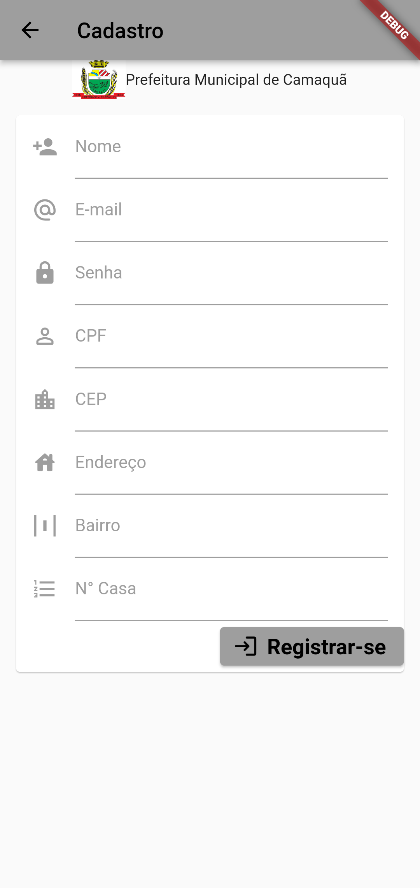
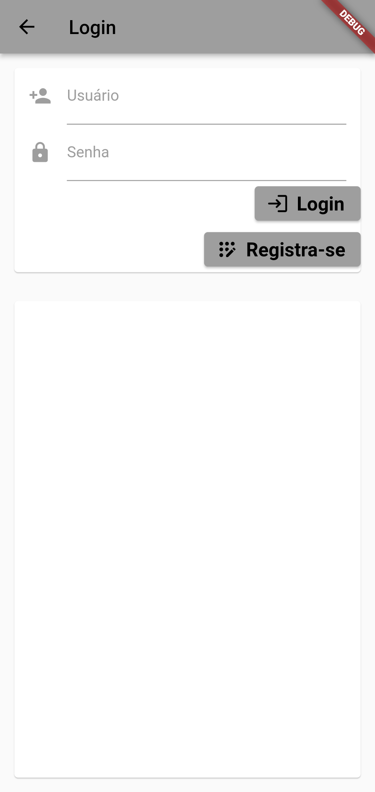
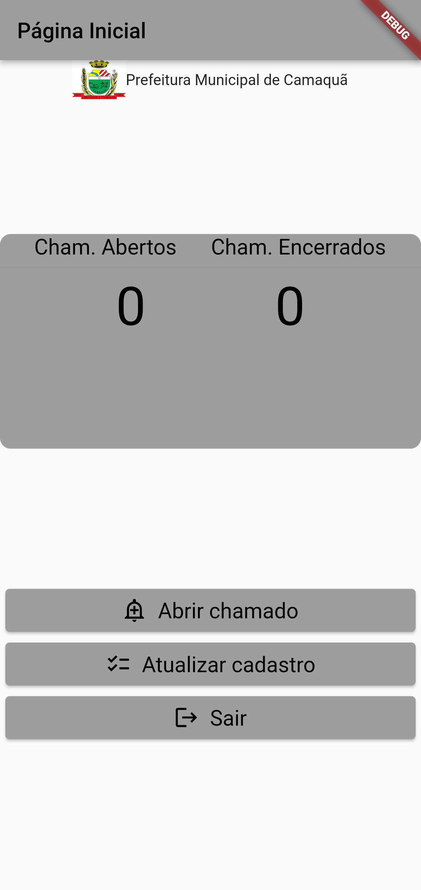
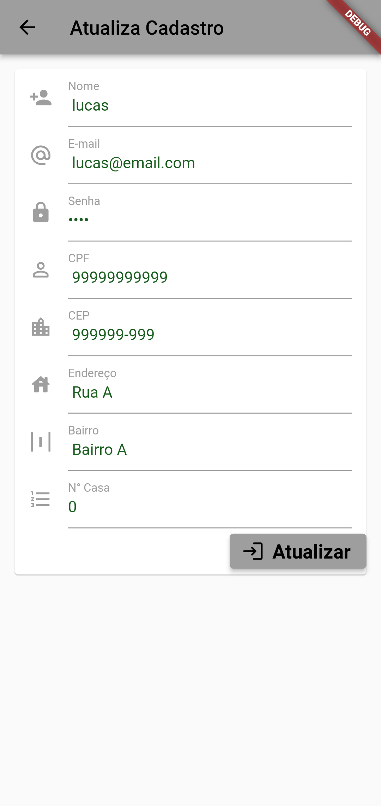

# Politiza

🚀 Esse projeto foi utilizado no desenvolvimento do meu trabalho de
conclusão da faculdade, no qual foi desenvolvido o protótipo de um
aplicativo que tem o objetivo de auxiliar os cidadãos da cidade de
Camaquã-RS a registrarem os incidentes que ocorrem na sua Comunidade
ao poder público, com a intenção de que os mesmos coletem os dados
desses incidentes e elaborem um plano de ação para a resolução desses
incidentes.! 🚀

### Pré-requisitos

Antes de começar, você vai precisar ter instalado em sua máquina as seguintes ferramentas:

Além disto é bom ter um editor para trabalhar com o código como [VSCode](https://code.visualstudio.com/) e Android Studio (https://developer.android.com/studio)

* Realize o download do projeto

1. git clone https://github.com/lucasrp98/politiza
2. instale o emulador no Andoid Studio
3. inicialize o emulador ou utilize o seu smartphone como emulador

### 🛠 Tecnologias

As seguintes ferramentas foram usadas na construção do projeto:

- [Flutter](https://flutter.dev/)

### Status
<h4 align="center"> 
	🚧  Flutter Select 🚀 Concluído ...  🚧
</h4>

### Screenshots

Tela de Abertura: Nesta tela o aplicativo é inicializado e fica por período de 5 segundos até que
é acionado o método "trocaTela()"que troca automaticamente para a tela de login do
aplicativo.

<h1 align="center">
  
</h1>

Tela de Cadastro: Nessa tela o usuário, será realizada a inserção dos dados do usuário e os mesmos
serão armazenados de forma local.

<h1 align="center">
  
</h1>

Tela de Login: Neste tela e se realiza a consulta no banco de dados local para averiguar se o usuário está cadastrado.

<h1 align="center">
  
</h1>

Tela Inicial: Essa tela redireciona os usuários a todas funcionalidades do aplicativo. 

<h1 align="center">
  
</h1>

Tela de Atualização: Nesta tela temos o mesmo layout da tela de atualização. Nela é possível alterar qualquer campo do usuário.

<h1 align="center">
  
</h1>

### Autor

Feito de ❤️ por Lucas Ribeiro👋🏽 Entre em contato!

<h1 align="center">
  
</h1>

   

